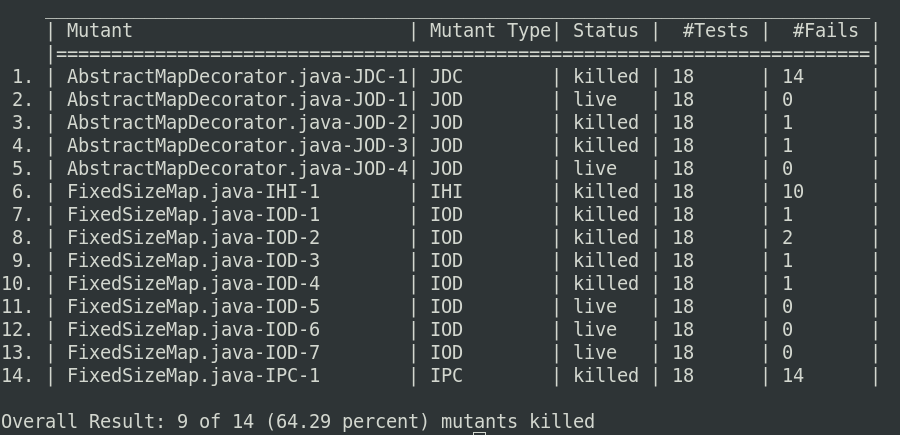

# java-mutant-runner
Seed a bug in one of your java class files (called a mutant). Then, make a list of these buggy java classes (mutants). Now you can use `java-mutant-runner` for compiling and running tests:
* `java-mutant-runner` replaces each buggy file (mutant) with original java source file.
* After replacing a buggy file, `java-mutant-runner` compiles our project.
* Now `java-mutant-runner` runs your JUnit test suites.
* At the end, `java-mutant-runner` reports you, which buggy class is discovered by your tests (killed by your tests)

## Usage
Download the jar of the project. Rename it to `mu-runner.java`. To use this tool do as follow:

- Create a folder named `mutants` which contains your buggy java classes. each file should be name with full package-name. also at the end of the name of file you should add type of mutant and number of mutant for this class, for example these are a valid mutants: 
`package.name.ClassName_typeOfMutant_theNumberOfMutant.java`
`org.example.MyClass_conditionalOperatorMutant_1.java`
- Create a folder named `project-src` which contains all of original src files of your project.
- Create a folder named `project-test-classes` which contains compiled tests. the test should be use JUnit4.
- [optional] A folder called `jars` contains all JAR file dependencies which need for running your tests.
- now run the tool like this:  
`java -jar mu-runner.jar -tests org.exmple.tests.TestClass1 org.exmple.tests.TestClass2` 
 
The output of the tool is something like this: 
 
 

